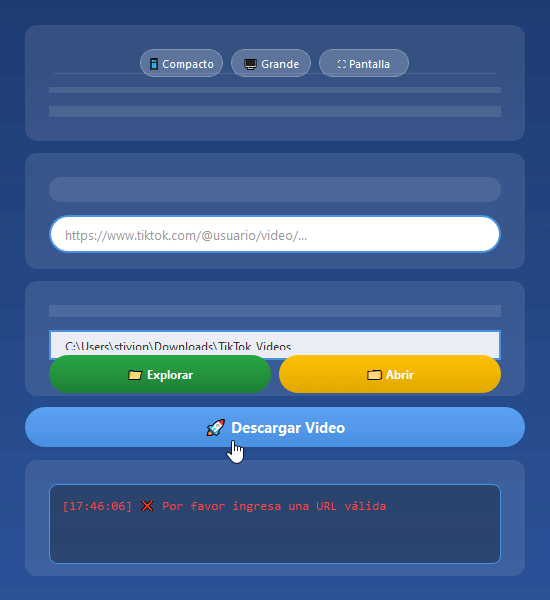

# 🚀 Stivion TikTok

**Stivion TikTok** es una herramienta con interfaz gráfica (GUI) desarrollada en Python para descargar videos de TikTok **sin marca de agua**, de forma rápida, sencilla y sin configuraciones complicadas.

<div align="center">
  
  <br>
  <em>🎥 Demostración de la aplicación en acción</em>
</div>

---

## 🧩 Características

- ✅ GUI intuitiva y fácil de usar (sin consola).
- 📥 Descarga videos directamente desde TikTok.
- 🚫 Sin marca de agua.
- 🔗 Solo se necesita el enlace del video.
- ⚙️ No requiere claves API ni configuración adicional.
- 🧠 Código limpio, ligero y mantenible.
- 🌍 Uso público y gratuito.

---

## 🖼️ Capturas de pantalla

> Puedes agregar aquí tus imágenes si deseas mostrar cómo se ve tu app.

```bash
📁 assets/
├── StivionTikTok.py       ← (Codigo)
├── README.MD        ← (Readme)
├── icon.ico        ← (Logo de la app)
├── icon1.gif        ← (GIF de demostración)
